# Chapter 5: Model and Result Analysis

[ < Back to Chapter 4 ](chapter4.md) | [ Master Index ](dissertation.md) | [ Next: Chapter 6 > ](chapter6.md)

---

After meticulously completing the data preparation and feature engineering, we will build the core analysis model. This research adopts a combination strategy of baseline comparison and front-edge exploration. These models aim to systematically address the core research questions of this study.

### 5.1 Part 1: Deconstructing Agricultural Vulnerability

#### 5.1.1 Model Selection Framework and Rationale

**Baseline Comparison: Justifying the Use of a Non-Linear Model**
To objectively assess the actual performance of an advanced machine learning model, such as XGBoost, and empirically test whether a non-linear relationship exists between yield and weather variables, this research first builds a widely accepted PanelOLS model (Panel Fixed-Effects Regression) as a theoretical benchmark. This model has been implemented in numerous classic studies (e.g., Dell, Jones, & Olken, 2012; Schlenker & Roberts, 2009). The advantage of this model is that it effectively controls factors that do not change over time or cannot be easily observed and measured. The core benefit is that it can separate the net impact of weather variables on crop yield by introducing entity fixed effects and time fixed effects.

This model serves as a benchmark; the key underlying assumption of a linear relationship limits its ability to capture complex, non-linear relationships and interactions between features. We evaluate the model's performance using the 2016 test dataset, and the outcome highlights the limitations of this key assumption. The model's coefficient of determination (R²) was very low for all four crops, with values of only - 0.07 for Wheat, 0.21 for Rice, -0.44 for Soybean, and 0.21 for Maize, respectively. Those figures indicate that a linear regression model can only explain a small portion of the variance in yield, especially for wheat and soybeans. The negative R² suggests that the predicted result is even worse than using the average of historical data directly, indicating the model's poor generalisation to out-of-sample data. It indicates that the relationship between agricultural yield and the climate indices—constructed through this study's sophisticated feature engineering—is not a simple linear combination.

| Crop | Full variable R² | Lasso filtered R² |
| :--- | :--- | :--- |
| Wheat | -0.07 | -0.07 |
| Rice | 0.21 | 0.13 |
| Soybean | -0.44 | -0.02 |
| Maize | 0.21 | 0.13 |
*Table 1: Performance of the PanelOLS (Panel Fixed-Effects Regression) Linear Benchmark Model. This table compares the coefficient of determination (R²) of the linear model for four crops, contrasting the performance using a complete set of variables with that of a feature set selected by the Lasso method.*

**Specification Comparison: Same-Year vs. Cross-Year XGBoost Models**
Due to the failure of the linear model, we will conduct an advanced non-linear model: the XGBoost algorithm (a machine learning method) to test the non-linear relationships. This section implements two model strategies. The core difference between these two models is that the cross-year model introduced the previous year’s weather variables as features for predicting the target variable. In contrast, the same-year model only includes the current year's weather matrix as input variables.

**Final Model Performance Summary (Default Params-Same Year Model)**
| Crop | Best Harvest Period | Final R² | Final MSE | Final MAE |
| :--- | :--- | :--- | :--- | :--- |
| Maize | 20 | 0.75 | 3.41 | 1.44 |
| Wheat | 20 | 0.65 | 1.52 | 0.94 |
| Rice | 14 | 0.85 | 2.66 | 1.24 |
| Soybean | 20 | 0.77 | 0.27 | 0.39 |

**Final Model Performance Summary (Cross-Year, Default Params)**
| Crop | Best Harvest Period | Final R² | Final MSE | Final MAE |
| :--- | :--- | :--- | :--- | :--- |
| Maize | 16 | 0.81 | 2.49 | 1.22 |
| Wheat | 15 | 0.74 | 1.14 | 0.87 |
| Rice | 18 | 0.78 | 4.03 | 1.33 |
| Soybean | 13 | 0.75 | 0.29 | 0.44 |
*Table 2: Performance Summary and Comparison of XGBoost Model Specifications. The tables display the final performance metrics, including R², MSE, and MAE, for two XGBoost model strategies: the "Same-Year Model" (top) and the "Cross-Year Model" (bottom). Metrics computed on the 2016 hold‑out year; training years: 1990–2015; no hyper‑parameter tuning (“default params”).*

According to the above performance evaluation matrix, both model strategies exhibit significantly better performance compared to the linear model. Furthermore, when comparing the two methods, we can conclude that for rice and soybeans, the same-year model performs better, with a higher R² and lower MSE & MAE; however, for maize and wheat, the cross-year model yields more advanced results based on the assessment parameters. These performance indicators suggest, at the Macro-level, the variance of the legacy effect and the same-year sensitivity of weather conditions on specific crops. While a formal statistical test for the significance of these differences was not conducted, these performance indicators provide a clear rationale for model selection for the subsequent attribution analysis.

#### 5.1.2 Time Sensitivity
Having selected the optimal model specification for each crop, this research now employs SHAP values to investigate the complex, non-linear relationships and reveal the core principle of ‘time sensitivity’ at a micro-level.

**The wheat/maize (cross-year model): distributed temporal dependence.**
The below beeswarm plot illustrates that, based on the cross-year model, According to the SHAP analysis, the feature with the most significant average impact on the model's predictions for wheat yield is the last winter cold wave (period23_coldwave_index_lag1) and the beginning period drought (period05_drought_index), the maize shows similar sensitivity for lag features (period22_coldwave_index_lag1, period23_drought_index_lag1), which indicates the legacy effect from the micro-level and exhibits a distributed temporal dependence.

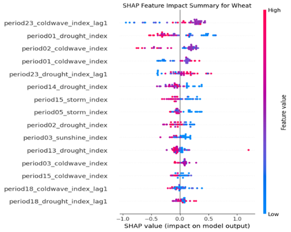
*Fig. 1: Summary of each explanatory variable's contribution to the SHAP values for the Wheat model. The position on the x-axis indicates the SHAP value, representing the feature's impact on the model output. The colour indicates the feature's value, with red representing higher feature values and blue representing lower feature values.*

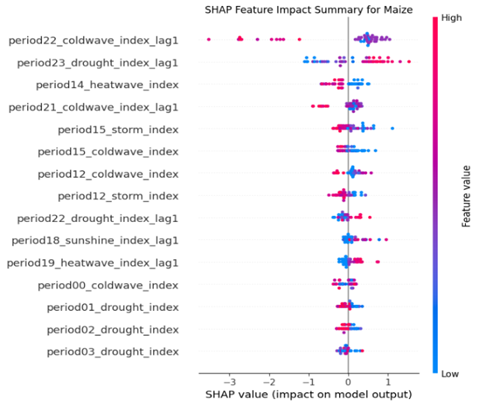
*Fig. 2: Summary of each explanatory variable’s contribution to the SHAP values for the Maize model. The position on the x-axis indicates the SHAP value, representing the feature's impact on the model output. The colour indicates the feature's value, with red representing higher feature values and blue representing lower feature values.*

**Rice/soybean: essential time window**
Based on the current year model, the early-year cold wave (period00_coldwave) and spring drought (period05_drought) are the contributors that affect yield estimation. The results of the soybean show similar sensitivity to spring drought (period04_drought) but a different time window for cold waves: early summer (period11_coldwave, period10_coldwave), which reveal the most crucial time windows for soil moisture and temperature management.
The further conclusion reveals that the same event occurring in different periods sometimes has a distinct impact on the estimation result. For instance, the same drought events with different growing stages have opposite effects (period 05 vs. period 09); a similar phenomenon has also been illustrated in the soybean beeswarm plot the cold wave in period 10 & period 13 have the same influence direction with heatwave in period 15, which means the same response for low and high temperatures, this indicates that the model has learned complex non-linear relationships using a data-driven methodology, instead of preset model assumption.

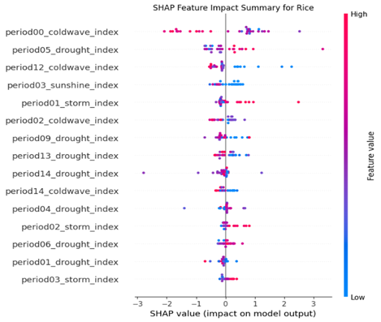
*Fig. 3: Summary of each explanatory variable's contribution to the SHAP values for the Rice model. The position on the x-axis indicates the SHAP value, representing the feature's impact on the model output. The colour indicates the feature's value, with red representing higher feature values and blue representing lower feature values.*

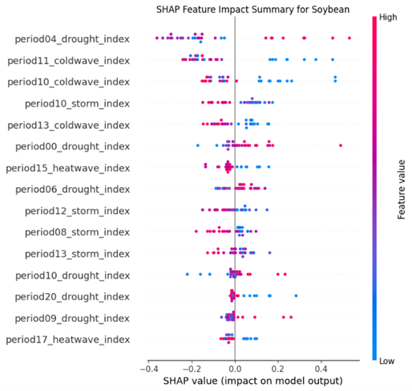
*Fig. 4: Summary of each explanatory variable's contribution to the SHAP values for the Soybean model. The position on the x-axis indicates the SHAP value, representing the feature's impact on the model output. The colour indicates the feature's value, with red representing higher feature values and blue representing lower feature values.*

#### 5.1.3 Condition Dependence

**Analysing Synergistic-like and Buffering Patterns in Model Predictions**
The SHAP interaction values reveal a synergistic pattern learned by the model, where two positive features may have a more positive influence than the sum of their individual effects. As shown below, the interaction value table for maize indicates a synergistic effect for compound events constituted by two favourable ones. The positive impacts of drought events in period 23 (SHAP value: 0.206) and moderate sunshine conditions (SHAP value: 0.048) exhibit a synergistic interaction effect (interaction value: 0.029). This demonstrates the integrated impact of a compound event, where the combined contribution exceeds the sum of their independent contributions, illustrating a "1 + 1 > 2" scenario.

| Feature 1 | Feature 1 SHAP Mean | Feature 2 | Feature 2 SHAP Mean | Interaction SHAP Mean |
| :--- | :--- | :--- | :--- | :--- |
| period23_drought_index_lag1 | 0.206431 | period22_coldwave_index_lag1 | 0.130784 | 0.000325 |
| period22_coldwave_index_lag1 | 0.130784 | period12_coldwave_index | 0.145166 | -0.104930 |
| period23_drought_index_lag1 | 0.206431 | period18_sunshine_index_lag1 | 0.048358 | 0.029040 |
| period23_drought_index_lag1 | 0.206431 | period14_heatwave_index | -0.062695 | -0.003563 |
*Table 3: Summary of SHAP interaction values for the Maize model. The table lists the mean SHAP values (main effects) and mean SHAP interaction values for key feature pairs. These are used to quantify patterns such as synergistic ("1 + 1 > 2") effects on the model's predictions.*

As shown below, the wheat interaction value table suggests a buffer-like effect learned by the model for the compound against two adverse events. The interaction effect of the period 05 storm (SHAP value: -0.034) and the period 02 drought (SHAP value: -0.029) (two model input features) has a positive interaction value (0.026), which suggests the spring storm and the prior period drought will buffer their individual effects for the model prediction value. The adverse impact of the final negative influence will be less than the simple sum of each negative implication.

| Feature 1 | Feature 1 SHAP Mean | Feature 2 | Feature 2 SHAP Mean | Interaction SHAP Mean |
| :--- | :--- | :--- | :--- | :--- |
| period01_drought_index | -0.018858 | period02_coldwave_index | 0.025673 | -0.000033 |
| period01_drought_index | -0.018858 | period14_drought_index | -0.060327 | 0.012747 |
| period05_storm_index | -0.034252 | period02_drought_index | -0.028724 | 0.026072 |
| period23_coldwave_index_lag1 | 0.027623 | period02_drought_index | -0.028724 | -0.005314 |
*Table 4: Summary of SHAP interaction values for the Wheat model. The table lists the mean SHAP values (main effects) and mean SHAP interaction values for key feature pairs. These values are used to quantify patterns such as buffering effect on the model's predictions.*

**Identifying Antagonistic & Diminishing Return Effects in the Model's Logic**
Two individual favourable events that occur together sometimes have a negative interaction value, meaning the integrated influence of the two events is less than the sum of each individual positive contribution. The 1+1<2 case indicates that a diminishing return effect exists for compound events. An example of this is also illustrated in the maize interaction value table above. Two favourable cold wave events occurred in the last winter (period22_coldwave_index_lag1) and early summer (period12_coldwave_index) with SHAP values of 0.13 and 0.15, respectively. When combined, they will have a substantial adverse interaction effect (interaction value: -0.10).
Another similar instance is illustrated in the soybean interaction value table below. Two consecutive cold wave events occurred in early summer and late spring, which have a positive influence individually (0.009, 0.06) when they are joint together, also resulting in a significant adverse interaction effect (interaction value: -0.037).

| Feature 1 | Feature 1 SHAP Mean | Feature 2 | Feature 2 SHAP Mean | Interaction SHAP Mean |
| :--- | :--- | :--- | :--- | :--- |
| period11_coldwave_index | 0.008840 | period10_coldwave_index | 0.062870 | -0.037259 |
| period04_drought_index | -0.049738 | period11_coldwave_index | 0.008840 | -0.019536 |
| period04_drought_index | -0.049738 | period10_coldwave_index | 0.062870 | 0.005346 |
| period10_coldwave_index | 0.062870 | period15_heatwave_index | -0.002382 | 0.001111 |
*Table 5: Summary of SHAP interaction values for the Soybean model. The table lists the mean SHAP values (main effects) and mean SHAP interaction values for key feature pairs. These values are used to quantify patterns such as antagonistic ("1 + 1 < 2") effect on the model's predictions.*

**Asymmetric Moderation & "Switch-like" Mechanism**

*"Switch-like" Mechanism for Wheat*
Dependence plots of wheat reveal a complex asymmetry and conditional dependence effect. The interaction effect direction changes with the switch of the main factor. This effect has two scenarios.
*First scenario :* In the plot below, where period23_coldwave_index_lag1 is the primary feature on the x-axis, we observe that high values (indicating a severe cold wave last winter) are associated with positive SHAP values, contributing to a higher predicted yield. In addition, the SHAP value forms a near-vertical line that is located entirely in the positive region of the y-axis (SHAP value > 0). When the cold wave index is equal to zero, which means the typical winter temperature will be consistently a favourable condition for model prediction, however, the magnitude of this positive contribution is not consistently determined by the interacting drought feature, as the red dot and blue dot are mixed in this plot, this might suggest the model has learned a higher order, more complex interaction.

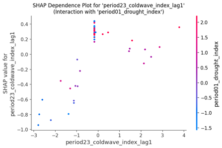
*Fig. 5: SHAP dependence plot for the period23_coldwave_index_lag1 feature in the Wheat model. The x-axis shows the value of the feature, while the y-axis shows its SHAP value (impact on the model output). The colour of each point represents the value of an interacting feature, period01_drought_index, revealing interaction effects.*

*The second scenario :* when the drought becomes the main event, the period01_drought_index on the x-axis shows the opposite effect; the SHAP value decreases as the drought index increases. This means that a high level of drought leads to a lower level (negative) SHAP value, which corresponds to a lower predicted yield value. Similarly, when the drought index value is around 2.5, the SHAP value also constitutes a vertical line, with purple and red dots mixed. In this line, indicating that the model consistently interprets an extremely high level of drought as an adverse condition, even in combination with a cold winter.

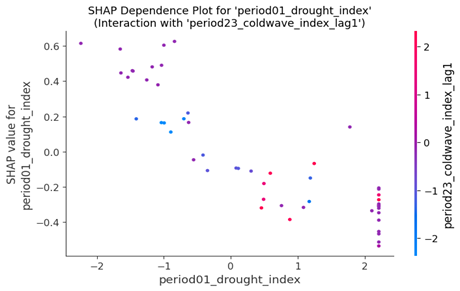
*Fig. 6: SHAP dependence plot for the period01_drought_index feature in the Wheat model. The x-axis shows the value of the feature, while the y-axis shows its SHAP value (impact on the model output). The colour of each point represents the value of an interacting feature, period23_coldwave_index_lag1, revealing interaction effects.*

*Asymmetric Moderation Effect for Rice*
The dependence plot below for rice exhibits asymmetric moderation, indicating a bidirectional amplification effect of drought. If the beginning of the year has favourable temperature conditions (period00_coldwave_index less than zero), the spring drought: red point in the plot (period_05_drought_index) will push the SHAP value upwards to a higher level, indicating that the spring drought contributes to a higher predicted yield, which means the positive effect will be enhanced. In contrast, under the adverse temperature conditions of the previous period, the drought events will lower the SHAP value, corresponding to a lower yield estimation, which means a further deterioration of the unfavourable situation.

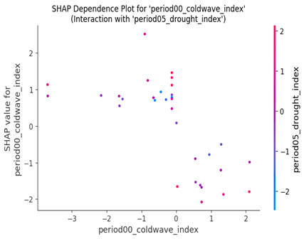
*Fig. 7: SHAP dependence plot for the period00_coldwave_index feature in the Rice model. The x-axis shows the value of the feature, while the y-axis shows its SHAP value (impact on the model output). The colour of each point represents the value of an interacting feature, period05_drought_index, revealing interaction effects.*

*Threshold effect of Maize*
The previous winter low temperature (period22_coldwave_index_lag) impact on the following year's maize yield estimation value displays a notable threshold effect. When the last winter cold wave level exceeds a specific limit, it can push the SHAP value to a higher level, which means it contributes to a higher level of maize yield estimation; however, the actual impact depends on the early summer temperature (period12_coldwave_index). A cool summer will further increase the SHAP value, corresponding to an enhancement of this positive effect. In contrast, a hot summer will lower the SHAP value, meaning it offsets the favourable influence.

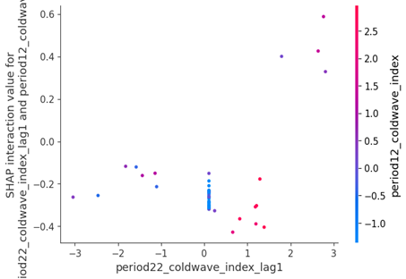
*Fig. 8: SHAP interaction plot for the period22_coldwave_index_lag1 and period12_coldwave_index features in the Maize model. The x-axis shows the value of the primary feature (period22_coldwave_index_lag1), while the y-axis shows the SHAP interaction value. This value represents the change in the primary feature's SHAP value that is attributable to its interaction with the second feature, period12_coldwave_index, whose value is shown by the colour of the points.*

#### 5.1.4 Regional Baseline
This section will compare the high-low yield region sample and further discuss how the timing-sensitive and condition-dependent factors, as illustrated in the previous section, impact the yield estimation result under various regional baselines. To understand precisely why the model generated such a high/low yield prediction for these specific cases, we can examine its SHAP waterfall plot. The plot decomposes this single prediction, showing how each feature's contribution contributed to pushing the model's output from the baseline expectation to the final predicted value.

**Attributable Regional Heterogeneity**
Under different regional baselines, similar compound events have entirely different effects in other areas. The high-low yield region comparison for wheat and maize reflects such patterns learned by the model.
For the high-yield region (The Mediterranean region of Italy) of soybean, a warm condition in the key growth stage, combined with moderate drought at the beginning of the growing season (period00_drought_index = 1.139), produced a combined SHAP value contribution summing to +0.6, which means this combination significantly pushed the final yield estimation higher.
In contrast, the low-yield region of soybeans (Semi-arid Northern China), where the same warm conditions are combined with a spring drought, produced a combined SHAP value contribution of nearly -0.7, indicating that this combination had a considerable negative impact on the yield estimation value.
The model consistently demonstrates high sensitivity to regional variations, suggesting that it has learned to treat geographical baselines as critical predictive factors. This provides model-based evidence that a uniform definition of extreme weather events (using the 95th percentiles / 5th percentiles) may be suboptimal for prediction; hence, regional heterogeneity should be considered as a baseline. Moreover, this baseline should be considered when analysing weather-related risks and adopting mitigation measures.

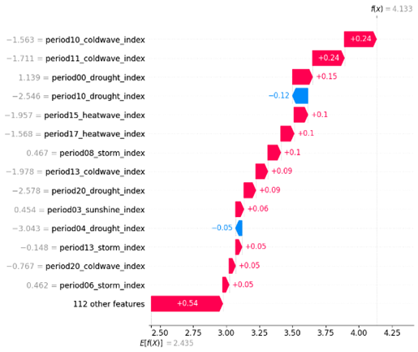
*Fig. 9: SHAP waterfall plot explaining a single prediction for the highest yield record in the Soybean model. The plot shows how the positive (red) and negative (blue) contributions from each feature shift the prediction from the base value (E[f(X)] = 2.435) to the final output value (f(x) = 4.133).*

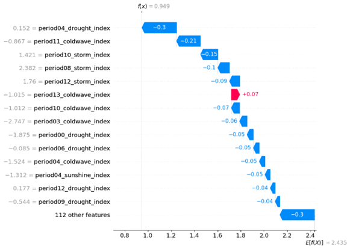
*Fig. 10: SHAP waterfall plot explaining a single prediction for the lowest yield record in the Soybean model. The plot shows how the positive (red) and negative (blue) contributions from each feature shift the prediction from the base value (E[f(X)] = 2.435) to the final output value (f(x) = 0.949).*

A similar pattern is observed in the high-yield maize region and the low-yield maize region. In the high Maize yield region (Southeastern United States), Drought events at the end of last winter (period23_drought_index_lag1 = 2.356) have a notable positive contribution to yield estimation; however, for the low yield region (Deccan Plateau region of India) under an unfavourable condition dominated by cross-year cold temperature (where period22_coldwave_index_lag1 = 1.387 contributed -3.52 to the prediction), a winter drought (period23_drought_index_lag1 = 1.791) produced a positive SHAP value of +0.5, indicating a slight buffering effect on the negative influence.

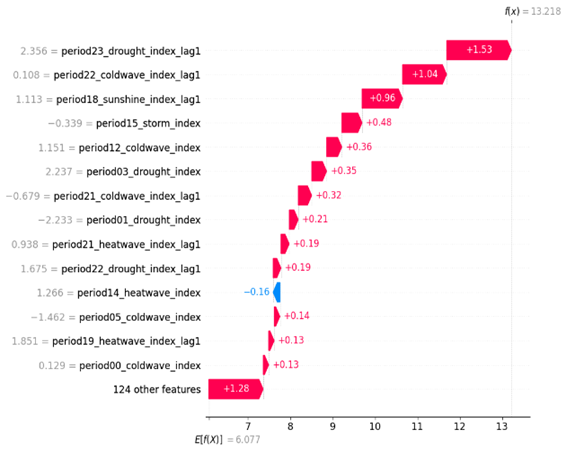
*Fig. 11: SHAP waterfall plot explaining a single prediction for the highest yield record in the Maize model. The plot shows how the positive (red) and negative (blue) contributions from each feature shift the prediction from the base value (E[f(X)] = 6.077) to the final output value (f(x) = 13.218).*

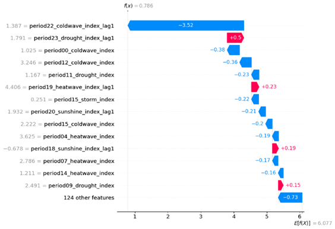
*Fig. 12: SHAP waterfall plot explaining a single prediction for the lowest yield record in the Maize model. The plot shows how the positive (red) and negative (blue) contributions from each feature shift the prediction from the base value (E[f(X)] = 6.077) to the final output value (f(x) = 0.786).*

**Vulnerability Amplification Mechanism**
The regional vulnerability not only exhibited the sensitivity to single unfavourable events but also reveals that the fragile hydrothermal balance of the vulnerable region will amplify the negative impact of compound events.
In the Low wheat yield region (Arid regions of southern Australia), warm weather of the previous winter (period23_coldwave_index_lag1=-1.298) and relatively mild temperatures in the early year (period01_coldwave_index=-1.915, period02_coldwave_index=0.099), combined with moderate drought in this period (period01_drought_index=1.187), create a compound stress effect, significantly pulling down the yield estimation level, The combined SHAP value contribution of these factors summed to -1.37. This is further evidence that multiple moderate-level weather events have a joint influence that amplifies the adverse effects of each event, especially under a vulnerable regional baseline.
The same example can be found for the low-yield soybean region (Semi-arid Northern China), the lower level soil moisture in spring (period04_drought_index=0.152) is the key driver for yield estimation value reduction; when combined with other factors like warm weather in early summer (period11_coldwave_index=-0.867) and strong winds during the growing season (period10_storm_index=1.421, period08_storm_index=2.382, period12_storm_index=1.76) will further suppress yield estimation. The combined SHAP value contribution of these factors summed to approximately -1.2, which further confirmed the amplification of adverse effects.

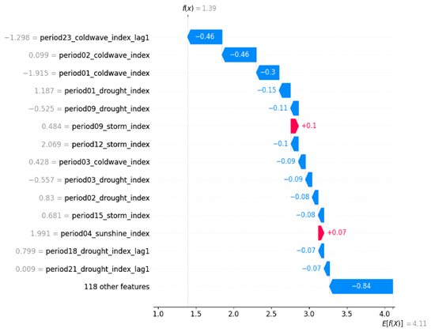
*Fig. 13: SHAP waterfall plot explaining a single prediction for the lowest yield record in the Wheat model. The plot shows how the positive (red) and negative (blue) contributions from each feature shift the prediction from the base value (E[f(X)] = 4.11) to the final output value (f(x) = 1.39).*

#### 5.1.5 First Model Summary
Different crops in various regions will have unique response patterns for differential weather-related risk; these patterns are constituted by the three core principles discussed in this chapter: time sensitivity (the time window of most significant influence), condition dependence (the interaction among compound events) and regional baseline (the different volatility under specific conditions). This chapter conducts an in-depth investigation of these patterns. It makes significant progress in addressing the current research gap by employing a data-driven methodology for quantifying non-linear relationships, evaluating them, and decomposing the compound event interaction mechanism.

### 5.2 Part 2: Bridging the Physical - Financial Divide - Explainable Analysis of Weather Risk Transmission
This section aims to address the core research gaps identified in Chapter 2, specifically the "Integration Gap" and the "Explainability Gap. Based on the key weather-related risk factors (core findings of Chapter 4), this section also adopts the same XGBoost + SHAP values, in-depth investigating how weather-related financial markets price risk transmission. Thus, provide a comprehensive attribution analysis for the entire chain, from physical climate risk transmitted through agricultural sectors, to its final reflection in market movements.

#### 5.2.1 Data and Modelling Methodology

**Data Description and Feature Selection**
*Target Variable:* As we select the S&P GSCI Index for the financial model's target variables, even though rice and maize are included in many sub-indices, there is no standalone sub-index for rice/maize. In addition, wheat is a more representative crop for food security compared with other crops. This chapter will use the wheat market as an example, adopting a time series model to estimate the closing price of the S&P GSCI Wheat Index, a global benchmark for wheat commodity futures prices. The target variable will be the GSCI index closing price.
*Explanatory variables:* Explanatory variables include average daily temperature and soil layer one water, extracted from the ERA5-Land dataset using the GEE platform. This choice is based on the most critical findings in Chapter 4: cold wave and drought are the most important influencers for wheat, this is calculated by the raw data (average daily temperature and soil layer one water) from the same data set, the same input feature of these two chapters inherently builds a bridge for physical shock to financial market which set a well-established fundamental for addressing the research gap identified in chapter 2 ( broken chain between physical & financial).

**Justification of Temporal Scope**
To investigate the general trend of the target variables, we first build an XGBoost model on the data range of 1990-2020, and then visualise the SHAP value using a time series plot, from the below plot we can easily identify the difference two patterns before and after 2008 which is the year of the global financial crisis, this might due to the post-financial-crisis period, the financial market changed markedly relative to the pre-crisis period, also lead to an increased financialization of commodity markets. Thus, we ultimately selected the period from 2008 to 2020 as our research data range for the financial model.

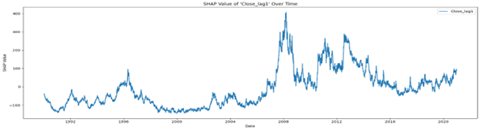
*Fig. 14: Time series plot of SHAP values for the Close_lag1 feature. The plot visualises the daily SHAP value for the previous day's closing price, illustrating how its impact on the model's output has varied over the period shown.*

**Model Selection**
Model performance metrics table:

| Model | MSE | MAE | MAPE (%) | MASE | R² |
| :--- | :--- | :--- | :--- | :--- | :--- |
| ARIMA (No Exogenous Vars) | 33.29 | 4.47 | 1.26 | 0.68 | 0.96 |
| ARIMAX (Target Lags + PCA Weather) | 33.57 | 4.48 | 1.26 | 0.68 | 0.95 |
| ARIMAX (With Exogenous Vars) | 1627.05 | 30.92 | 8.76 | 4.70 | -1.19 |
| XGBoost (Only Own Lags) | 41.72 | 5.04 | 1.42 | 0.79 | 0.94 |
| XGBoost (Raw Climate Features + multi-lag) | 43.16 | 5.09 | 1.44 | 0.80 | 0.94 |
| XGBoost Rolling Forward (with LEAD feature) | 43.68 | 5.13 | 1.45 | 0.81 | 0.94 |
*Table 6: Model Performance Assessment and Comparison Matrix. This table compares the performance of various time series models (ARIMA, ARIMAX, and XGBoost) to justify the final model selection. While the pure ARIMA model shows the highest statistical performance, the XGBoost model was chosen for its superior ability to provide a robust framework for an explainable analysis of complex feature impacts.*

*The Limitation of Pure ARIMA (best performance):* From the comparison of different model strategies, the best performing model is a purely autoregressive model, ARIMA, which only includes its lag term. This is mainly because the target variable (GSCI index) is a typical financial index that exhibits autocorrelation; the autoregressive model can effectively capture this characteristic. However, this chapter aims to answer the research questions raised in Chapter 2: how physical world shocks are transmitted to the financial market. A simple statistical model cannot explain or address this problem.
*The Deficit of ARIMAX:* If we attempt to apply the ARIMA method to answer this question, the model's performance deteriorates dramatically when exogenous variables are incorporated into ARIMAX, with an R² value of -1.19. This indicates the model's weak ability to identify the non-linear relationship and interaction effect. Although the ARIMA is described as a white box, the Model coefficients have economic meanings; however, the weak robustness of the model itself limits its explainability.
*The Deficit of Explainability of PCA& ARIMAX Mixed Method:* The efficient way to improve the ARIMAX model is to use the PCA method to reduce the dimensions of the raw weather features. After this feature engineering, the model performance can recover to a similar level of pure ARIMA. This is consistent with the presence of complex, non-linear characteristics in the dataset; moreover, this leads to another problem: the features constructed by the PCA method will lose their original meanings, and the model coefficients can no longer have an economic explanation for the PCA method ARIMAX.
*Final Model Choice: XGBoost + SHAP:* In contrast, as we discussed in the methodology chapter, the XGBoost + SHAP values can reasonably handle this situation, and the good performance of the XGBoost model built upon weather features and Close_lag provide a solid foundation for SHAP values to explain the complex relationship and interaction effects, finally opening the “black-box”. However, the performance is better for the XGBoost model, which only has lag features in terms of weather. Still, the importance plot of the model, which also features lead indicators, revealed the market's forward-looking characteristics (discussed in the following section). The slight decrease in model performance may be due to interactions among weather features, which introduce more noise to the model and deteriorate its accuracy.

#### 5.2.2 Results and SHAP Analysis

**Global Feature Importance: Market Inertia vs. Aggregate Weather Risk**
*Model's Reliance on Autoregressive vs. Exogenous Features:* The financial market index exhibits strong autoregressive characteristics; the most influential factor is the previous day's index value, but based on the current XGBoost Model SHAP value, the other, the sum of index lag feature SHAP values (more than 51), is much higher than the weather features (around 28). Still, the percentage of all-weather features reached 36%, which means that although each zone's contribution is not significant, the aggregate impact cannot be ignored; this further vindicates our model choice strategy.

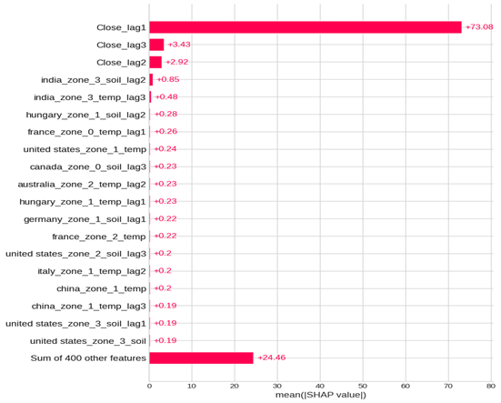
*Fig. 15: Global feature importance plot for the financial model. Features are ranked by their mean absolute SHAP value, which represents their average impact on the model's output across all predictions.*

**Decomposing the Model's Primary Driver: SHAP Value Trends of the Lag Feature**
This seasonal decomposition plot analyses the different components of the SHAP value trend for the Close_lag1 feature. An analysis of the original time series (top panel) reveals that the SHAP value exhibits a general increasing trend. However, it illustrates two distinct parts with a dividing point in 2019: the first part decreases from -25 (2018) to its lowest value of -125 (2019); the second part increases from the trough to the peak value of 20 (in late 2020). During this period, the value has been positive since early 2020. This may reveal unfavourable information circulating in the market for the post-COVID period. The GSCI index lag1 feature pushed the prediction value to a higher level, demonstrating that the market exhibited significant upward momentum after 2020. The below decomposition SHAP Value displays that the trend component is the most significant part for the change of the original SHAP time series plot, which has the similar trend with the original trend plot, the seasonal change only represents a minimal part change from -3 to +1, this minor part does not have an apparent influence on the original trend.

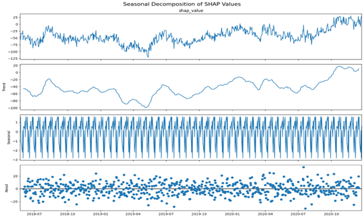
*Fig. 16: Seasonal decomposition of the SHAP value time series for the Close_lag1 (the most important feature). The plot decomposes the original daily SHAP value series (top panel) into its trend (second panel), seasonal component (third panel), and residual component (bottom panel).*

**Analysing the Model's Response to Weather Features: The Dominance of Residual Shocks**
Compared to the Close_lag1 plot, this most influential weather feature has a significantly smaller SHAP value (united_states_zone_3_temp_lead2), indicating that even the aggregate impact of all-weather features is the second-largest driver factor; the single factor has much less influence, changing between (-1, 1). Unlike Close_lag1, this feature exhibits a distinct structure with significant seasonal characteristics, fluctuating within a range of (-0.03, +0.03). The trend component of the SHAP is a relatively minor part compared to the original trend, with a range of (-0.3, 0.1). The residual component is the primary component in this weather feature time series plot, with a data range of (-1.0, 1.0), which may indicate extreme weather scenarios that have suddenly impacted the market. In conclusion, for the weather factor, the change in SHAP value is predominantly driven by random shocks.

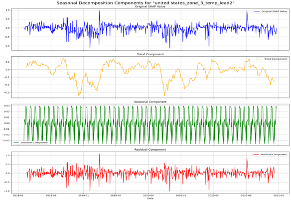
*Fig. 17: Seasonal decomposition of the SHAP value time series for the united_states_zone_3_temp_lead2 ( the most important weather feature). The plot decomposes the original daily SHAP value series (top panel) into its trend (second panel), seasonal component (third panel), and residual component (bottom panel).*

**Temporal Dynamics: Lead vs. Lag Effects**

| Feature | Mean Lead SHAP Value | Mean Lag SHAP Value | Description (EN) |
| :--- | :--- | :--- | :--- |
| united states_zone_3_temp | 0.0898 | 0.0448 | U.S. Southern Great Plains Wheat Region |
| brazil_zone_0_temp | 0.1027 | 0.0633 | Northeast Brazil Semi-Arid Agricultural Frontier |
| china_zone_1_soil | 0.0831 | 0.064 | Northeast China Semi-Arid Transitional Zone |
| china_zone_5_soil | 0.0581 | 0.093 | Northeast China Cold-Temperate Agricultural Region |
| brazil_zone_1_soil | 0.0936 | 0.0636 | Southern Brazil Agricultural Core Region |
| italy_zone_2_soil | 0.064 | 0.0614 | Southern Italy Mediterranean Coastal Agricultural Region |
| brazil_zone_3_temp | 0.0785 | 0.0542 | Central-West Brazil Cerrado Tropical Savanna Core Agricultural Region |
*Table 7: Comparison of Mean SHAP Values for Lead (Forecast) and Lag (Historical) Weather Features. This table quantifies the model's sensitivity to future versus past weather information. It shows that the model's predictions are generally more sensitive to future weather forecasts (lead features) than to past, occurred events (lag features), illustrating the market's forward-looking nature.*

The average SHAP value for lead and lag weather features shows that the majority of wheat zones ‘predictions are more sensitive to future weather change, which can be estimated and released in weather prediction information; the financial market could quickly capture this change and reflect it as a price adjustment, which illustrates the market's efficiency and forward-looking nature.
The most crucial influencer is temperature for the U.S. Southern Great Plains region. For this variable, the average SHAP value for the lead feature is nearly twice that of the lag feature. In contrast, the Northeast China Cold-Temperate Agricultural Region’s lag soil water features have a higher average SHAP value compared with the lead feature. The difference between USA and China, might be due to entirely different economic model, USA is highly market dominant economic and financial system(Hall & Soskice, 2001), but for China, the government is more potent for market control and economic adjustment(Pearson, Rithmire, & Tsai, 2023), so this lead to different information transmission patterns, regarding China’s information, might be most of the traders are heavily rely on government public information instead of pure weather prediction.

**Interaction Effects: Uncovering Non-Linear Relationships**

*General Impact Analysis (from beeswarm Plot)*
To understand the model’s overall reliance on different weather features, global feature importance is calculated by the mean absolute SHAP value across each input variable. Based on SHAP value analysis, the most critical weather factor is the temperature of the U.S. Central and Southern Plains Wheat Core Region (Zone 3), which represents one of the most vital wheat high-yield regions. The market has been significantly influenced by weather forecasts in these regions, which might lead to changes in wheat yield and production, having a considerable impact on the supply end.
The SHAP analysis indicates that the model is highly sensitive to temperature variables; it has learned a positive relationship between high temperatures and the wheat index prediction, which might be because cool weather conditions are favourable for wheat growth and yield increases. From the SHAP value beeswarm plot, we can see that wet weather conditions in climate-vulnerable regions such as the semi-arid transitional belt of North-Central China (Zone 2), the humid eastern provinces of Canada (Zone 0), the drought-sensitive Mediterranean lowlands of Southern Italy (Zone 2), and the tropical agricultural frontier of Central Brazil (Zone 3) are generally have positive impact on the wheat futures index prediction value, this might due to the change weather conditions in fragile regions lead to more uncertainty from agriculture products demand end with lead to market fluctuates.
The model has learned the following pattern: The traditional wheat high yield zone, Brazil's Southern Core Wheat Region (Zone 1), Brazil’s Northeastern Agricultural Frontier (Zone 0), China's Northeastern Transitional Zone (Zone 1), and India's Northern Agricultural Region (Zone 3), wet weather prediction which related to a negative SHAP value, means it will cause, high yield estimation and more production from supply end, hence this will decrease the wheat market price which reflected in the futures price index, lead to decrease of GSCI wheat index, in contrast, the drought weather of U.S. Central and Southern Plains Wheat Core Region (Zone 3) which corresponded to a negative SHAP value means it also have negative impact on the market price, this may be because the weather prediction already reflected in previous days price over adjustment, and the current market have the correct action when the news have been absorbed.

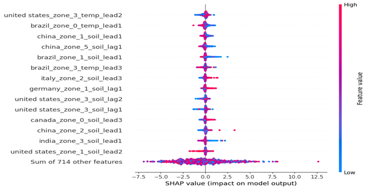
*Fig. 18: SHAP (beeswarm) summary plot of feature impacts, with the Close_lag features excluded to visualise the influence of weather-related factors better. The position on the x-axis indicates the SHAP value (impact on model output), and the colour represents the feature's value (red for high, blue for low)*

*Threshold, Amplification, and Buffering Effects*
**United_states_zone_3_temp_lead2 VS China_zone_4_soil_lag2**
The extreme temperature estimate (for the next 2 days) of the U.S. Southern Great Plains wheat belt has a strong influence on the estimation value of wheat futures index; moderate temperatures have SHAP values around zero, lower temperatures and higher temperatures both have negative SHAP values, which means negative impacts on the index prediction, and the previous days' drought or wet weather in Northeastern China’s cold temperate agricultural zone ( spring wheat region) will have a amplify influence for the negative impact (with the push downward effect of SHAP value), which means from the pattern learned by the model the futures index prediction will have more fluctuation if the unfavourable weather estimate combined with a past bad news, the model predicts a more pronounced negative outcome under such compound conditions. The decline is relatively steep on the left side, which means the index prediction is more sensitive to lower temperatures.

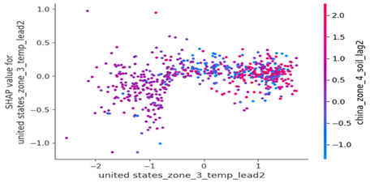
*Fig. 19: SHAP dependence plot for the united_states_zone_3_temp_lead2 feature. The x-axis shows the value of the feature, while the y-axis shows its SHAP value (impact on the model output). The colour of each point represents the value of an interacting feature, china_zone_4_soil_lag2, revealing interaction effects.*

**Brazil_zone_0_temp_lead1 VS India_zone_4_soil_lag1**
The range of SHAP values distributed from -1.0 to +1.0 means the impact changes significantly. The climate-vulnerable region of Brazil (Northeast Brazil’s semi-arid agricultural frontier) with higher temperature estimation will lower the index prediction. This effect will be moderated by the past few days' wet/dry weather conditions in India's North-Central Wheat and Rice Belt, which the model learns. The unfavourable news, which previously resulted in a higher SHAP value, will mitigate the negative impact due to increased demand from fragile regions, as Brazil is the leading wheat-importing country, with import value far exceeding its export value.

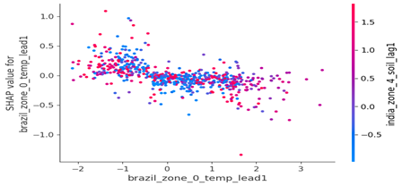
*Fig. 20: SHAP dependence plot for the brazil_zone_0_temp_lead1 feature. The x-axis shows the value of the feature, while the y-axis shows its SHAP value (impact on the model output). The colour of each point represents the value of an interacting feature, india_zone_4_soil_lag1, revealing interaction effects.*

**China_zone_1_soil_lead1 VS Canada_zone_1_soil_lead2**
The interaction between the weather forecasts of semi-arid inland regions in north-central and western China, and Eastern Canada, illustrates a butterfly pattern, representing a complex, non-linear relationship. The red point (higher level of soil moisture) is more centralised in the middle (smaller change range of SHAP value). The blue dot (lower level of soil moisture) is more distributed in the negative part of the butterfly, which means the specific combination of wet weather in China, and drought in Canada will constitute a significant negative SHAP value, which means a lower estimation of wheat futures index, this revealed the more complex interaction learned by the model.

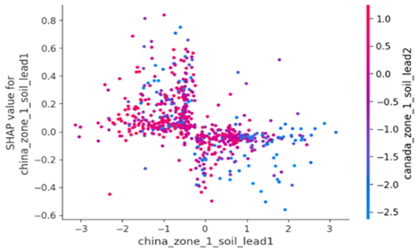
*Fig. 21: SHAP dependence plot for the china_zone_1_soil_lead1 feature. The x-axis shows the value of the feature, while the y-axis shows its SHAP value (impact on the model output). The colour of each point represents the value of an interacting feature, canada_zone_1_soil_lead2, revealing interaction effects.*

*Local Attribution: Deconstructing Extreme Market Events*
For the historical peak point, the previous day's close price contributes to the most considerable SHAP value; however, the weather conditions in multiple regions also impact the index value estimation. The unfavourable weather conditions in the northern Himalayan hill region and the northwestern semi-arid plains of India have further pushed the index’s estimation to a higher level; however, the weather conditions in other areas, such as those in Brazil, have buffered this impact. This means that global weather features have an aggregate effect on the market. However, as concluded in the previous section, the waterfall plot for the historical peak (Fig. 22) clearly shows that the model's prediction was overwhelmingly driven by the positive SHAP value of the 'Close_lag1' feature.

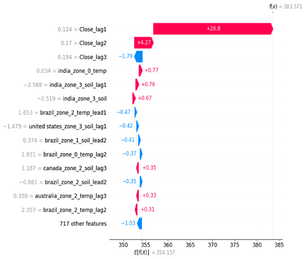
*Fig. 22: SHAP waterfall plot explaining a single prediction for a historical peak point. The plot shows how the positive (red) and negative (blue) contributions from each feature shift the prediction from the base value (E[f(X)] = 354.157) to the final output value (f(x) = 383.571).*

This has also been demonstrated in the lowest price waterfall plot; the previous day's lower index value significantly pulled down the current day's price, while the weather condition has only a minor impact. Although weather factors contribute to over 30% of the influence at a global level, in extreme scenarios, the model has learned to heavily prioritise market inertia over exogenous weather shocks when making its predictions.

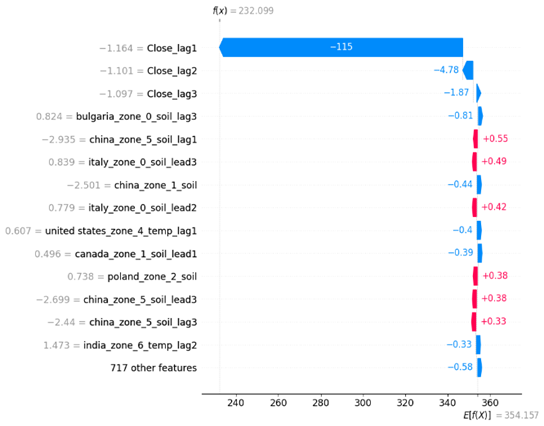
*Fig. 23: SHAP waterfall plot explaining a single prediction for a historical low point. The plot shows how the positive (red) and negative (blue) contributions from each feature shift the prediction from the base value (E[f(X)] = 354.157) to the final output value (f(x) = 232.099).*

#### 5.2.3 Conclusion for the second model
The core finding of the second model is the duality of drivers: the primary influencer is market inertia, which presents a long-term and smooth trend. In contrast, the second influencer -weather factors have significant seasonal characteristics, and the residual part dominates the change in this. This makes it more challenging to estimate and quantify the sudden shock of weather-related risk. Moreover, the weather factors also have complex, non-linear relationships and interactions, like those in the first model. Finally, the temperature of the U.S. Southern Great Plains wheat belt is the most influential weather factor, highlighting the importance of the USA's traditional wheat region for global wheat production and trade.

---
[ < Back to Chapter 4 ](chapter4.md) | [ Master Index ](dissertation.md) | [ Next: Chapter 6 > ](chapter6.md)
